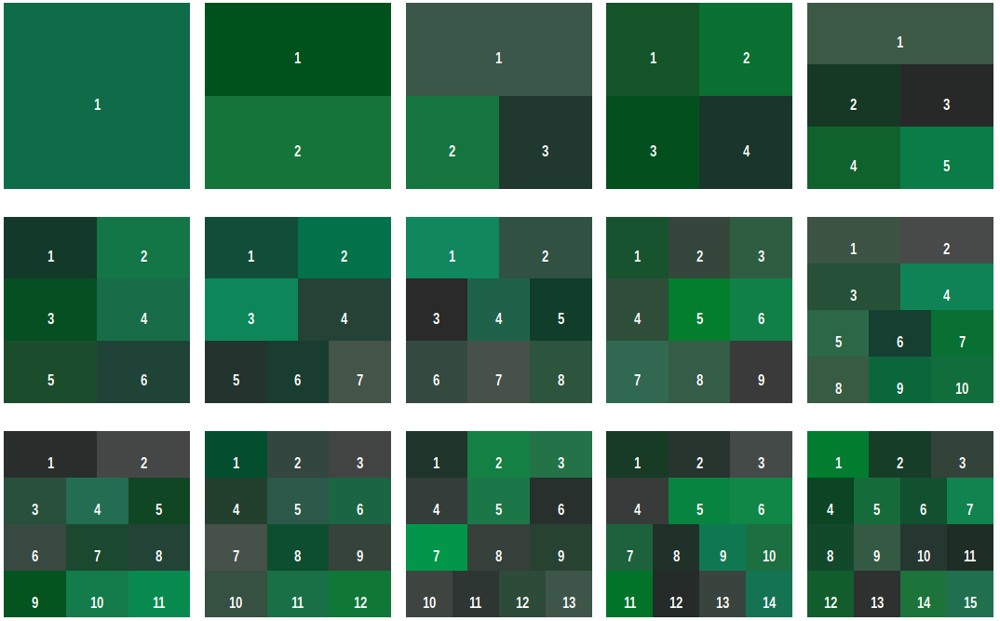
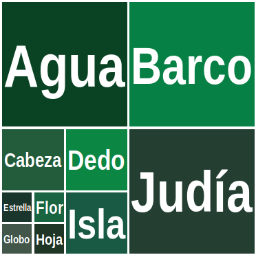
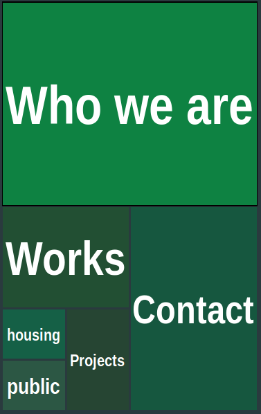

# Taxogrid designer

This application renders a recursive division of a rectangle. It is inspired by [treemaps](https://en.wikipedia.org/wiki/Treemapping), [chinese character decomposition](https://en.wikipedia.org/wiki/Chinese_character_description_language) or [Metro](https://en.wikipedia.org/wiki/Metro_(design_language)) minimalist design.

## Methods

You can choose between several ways to render your boxes

- Css Flex
- Css Grid
- SVG (not yet implemented)

## Samples

You can being trying a flat structure like `[1 2 ...]` to `[1 2 3 4 5 6 7 8 9 10 11 12 13 14 15]` with no margin between cells, using CSS Grid:

Now, you may try hierarchies:

e.g. some spanish words, whose acrophones  map into alphabet, like `[Agua Barco [Cabeza Dedo [Estrella Flor Globo Hoja] Isla] Judía]`

e.g. You can design web interfaces. Try `["Who we are" [Works [housing public] Projects ] Contact]`

## Reserved characters

+ brackets `[ ]` represent hierarchy
+ space separates tokens
+ quotation marks `" "` or `« »` group
  tokens that contain spaces

## Dependencies

this app uses [fitty](https://github.com/rikschennink/fitty)

## Todo

improve also vertical text fitting

Implement edition: drag & drop, maybe import from CSV

SVG rendering

------

2019 Alejandro Rojo Gualix

CC BY-NC Attribution & Non-commercial